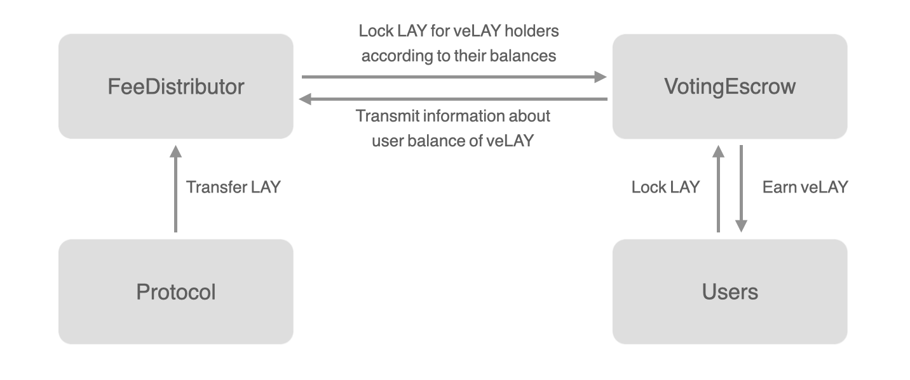
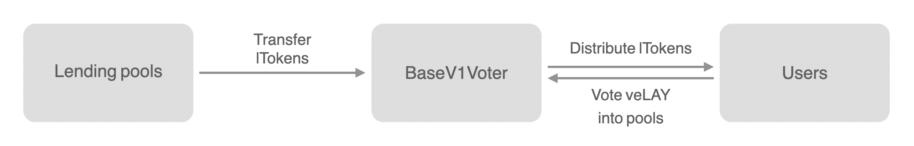

# oasyslend-ve

OasysLend has a voting escrow function. The voting escrow function mainly offers two incentives to users who lock OAL tokens.

- Locking OAL boosts the rewards for new OAL in circulation
- Voting veOAL allows voters to earn protocol fees accumulated in their voting pool

## Design

### Locking OAL

A user can lock OAL for up to 2 years and acquire veOAL. The veOAL a locker can obtain depends on the duration of the lock, so the longer the user locks OAL tokens, the more veOALs he/she can earn. The amount of veOAL decays linearly over time and at the end of locking period it will be lost.

Three functions are implemented to allow users to lock OAL tokens at will.

1. `createLock()` can create a new lock on a OAL token
2. `increaseAmount()` can increase the amount of OAL to be locked without changing the lock period
3. `increaseUnlockTime()` can increase the locking period without changing the amount of OAL to be locked

In addition, we have also implemented the `createLockFor()` and `depositFor()` functions to allow users to lock OALs for other users. If the lock has expired, the user can withdraw all OAL tokens by using `withdraw()`.

The VotingEscrow contract has several functions to check the balance and total supply of veOAL.
The differences between these functions are summarized below.

- `balanceOfLockerId()` returns the current balance of veOAL
- `balanceOfLockerIdAt()` returns the balance of veOAL at certain time between last user point time and the current time
- `balanceOfAtLockerId()` returns the balance of veOAL at a certain block height
- `totalSupply()` returns the current total supply of veOAL
- `totalSupplyAtT()` returns the total supply of veOAL at a certain time between last point time and the current time
- `totalSupplyAt()` returns the total supply of veOAL at a certain block height

#### Boosting rewards



veOAL holders may boost their OAL rewards according to the amount they hold. Specifically, the OAL rewards allocated for veOAL holders are accumulated on a weekly basis and distributed according to the percentage of holdings against total veOAL in the supply. The distributed OAL rewards are not immediately transferred to the user address, but are added to the user's locked amount each time rewards are claimed by calling `claim()`. As a result, it appears that veOAL is increasing, not OAL, until the lock period ends and users withdraw their OALs.

Example) Suppose there are three users who acquire veOAL at some point in past: user 1 locked 50 OAL for 2 years, user 2 locked 30 OAL for 2 years, and user 3 locked 40 OAL for 1 year. In this case, the veOALs supplied to user 1, user 2 and user 3 would be 50 veOAL, 30 veOAL and 20 veOAL, respectively. If the reward to be distributed at the next week was 50 OAL, then according to the holding amount of veOAL, the locked amount of user 1, user 2, and user 3 would increase by 25 OAL, 15 OAL, and 10 OAL,　 respectively.

### Voting veOAL



A user can use veOAL to vote for their favorite pool. Voter contract provides three functions for voting.

1. `vote()` votes all veOALs into pools with a user-specified weight
2. `reset()` resets the vote by setting the vote weights of all pools to zero
3. `poke()` re-votes all veOALs into the pools with the same weight as the previous vote, which is used if the user acquires more veOALs

The LTokens accumulated as a protocol fee in each pool is tallied every week. The protocol fees are distributed to users according to the percentage of their vote against the total vote for the pool. Although LToken increases in value over time, the amount of the distributed fees also increase at the same rate, so that the obtained fee never depends on the timing of receipt. The fee can be transferred to the user address at any time by calling `claim()`.

Example) Suppose user voted 50 veOAL for a USDC pool and the total supply for a USCD pool was 1000 veOAL. In the case that the protocol fee generated by USDC pool were 500 lUSDC in that week, the user may receive 25 lUSDC.

## Development

### For Local

Launch

```bash
yarn hardhat node
# deploy
yarn deploy-with-mock:local
yarn task:migrate:set-agency-at-launch:local
yarn task:migrate:add-tokens-at-launch:local
# check after deploy
yarn task:check:deployed-contracts:local
yarn task:check:term-status:local
```

Test

```bash
yarn test test/ve/{voter.test.ts,voter.2.test.ts,ve.test.ts,ve.2.test.ts}
# extra (for confirm behavior)
yarn test test/ve/{voter.perf.1.test.ts,voter.logic.1.test.ts}
```

### For Production

Operations: checkpoint for term

```bash
# execute
yarn task:exec:checkpoint-of-contracts:astar
# check
yarn task:check:voting-weights:astar
yarn task:check:tokens-per-week:astar
```
